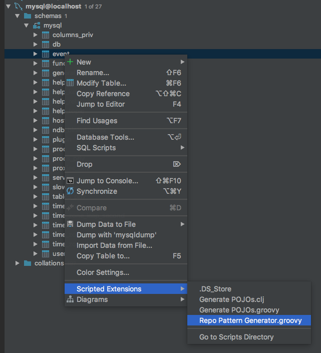

# Repo Pattern Generator

This is a PHPStorm/IntelliJ IDEA **Scripted Extension** that generates an Entity and Repository class from one or more database tables.

## Installation

On MacOS, copy the file `src/Repo Pattern Generator.groovy` into 

	$HOME/Library/Preferences/PhpStorm2018.1/extensions/com.intellij.database/schema

(Adjust the path according to your product and version.)

## Running

In the **Database** view, right click a table and select **Scripted Extensions** / **Repo Pattern Generator**.

## Limitations

The generator assumes that there is a primary key on one field and this field is an auto increment integer.